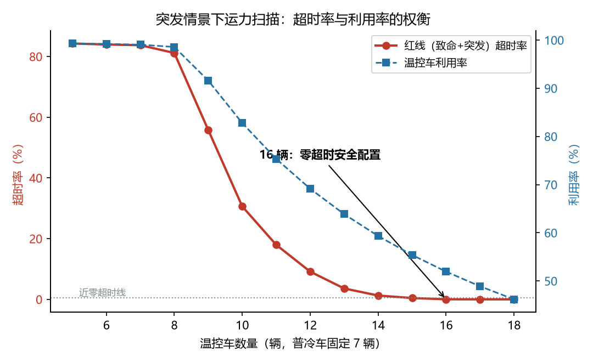
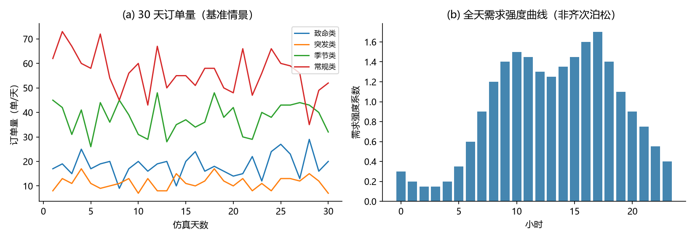
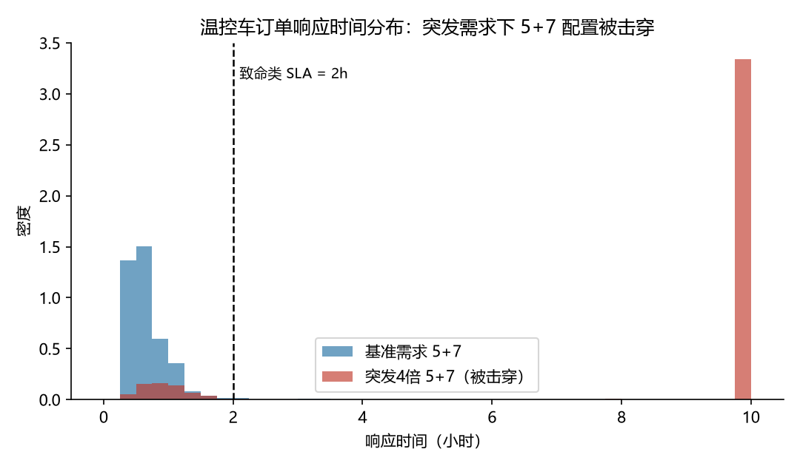
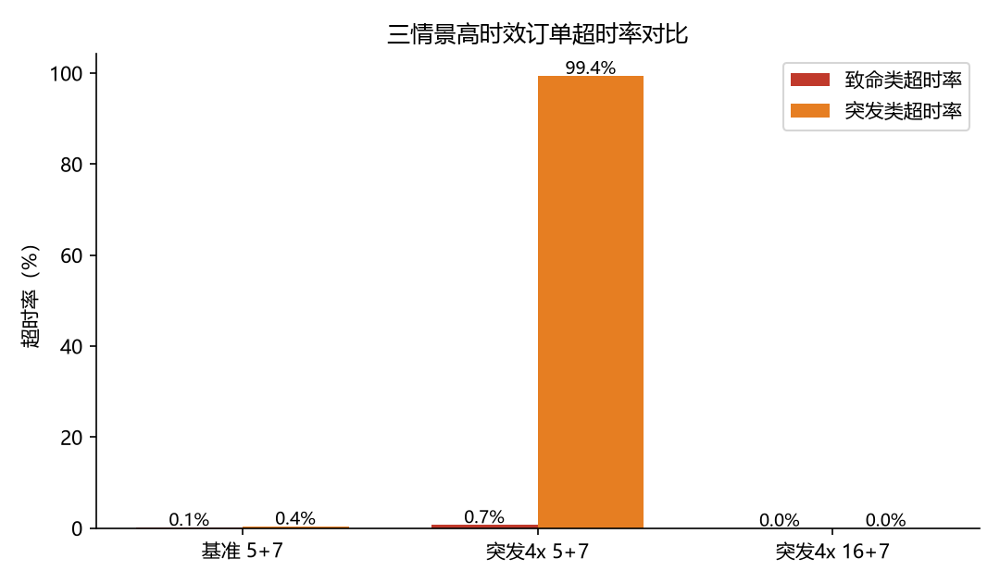

# 医疗药品配送网络 · 运力配置仿真优化
# Medical Logistics Delivery Network — Fleet Capacity Simulation

> 四类药品、11 个需求节点、2 小时最严时效——温控车到底配多少辆才"既不超时、又不烧钱"？
>
> 本项目源于一次医疗物流运力配置课题：原版使用 **FlexSim**（可视化建模）与 **Gurobi** 完成建模与求解；
> 本仓库用 **Python + SimPy** 将核心调度逻辑独立复现，验证并展示完整结论。

[]()
[]()
[]()

---

## 📌 核心结论（TL;DR）

| 情景 | 温控车/普冷车 | 突发需求 | 结果 |
|------|--------------|----------|------|
| 基准 | 5 + 7 | — | ✅ 够用：致命类超时率 0.11%，P95 响应 1.14h（SLA 2h） |
| 突发 4 倍 | 5 + 7 | ×4 且成簇 | ❌ **被击穿**：突发类超时率 99.4%，温控车利用率 99.3% |
| 突发 4 倍 | **16 + 7** | ×4 且成簇 | ✅ **零超时安全冗余配置**：致命类 0%，突发类 ≈0%，利用率 52% |

**一句话**：真正的零超时安全配置是 **16 辆温控车**——不是平均单量算出来的，
而是"突发需求半小时内成簇爆发"撞出来的。

## 🔍 关键发现：平均利用率会骗人

突发需求放大 4 倍时，若按**均匀放大**估算，12 辆左右温控车即可覆盖。
但仿真显示 12 辆仍有 9% 超时——因为**突发需求不是均匀的，是成簇的**：
半小时内涌进一串订单，排队瞬间击穿 2 小时时效。
这就是排队论公式低估运力、而离散事件仿真有价值的原因（详见 `docs/01`）。



## 📊 全部结果

| 图表 | 内容 |
|------|------|
|  | 四类药品 30 天订单量 & 全天需求强度曲线 |
|  | 突发前后温控车订单响应时间分布（5+7 被击穿） |
|  | **核心图**：超时率-运力权衡曲线，16 辆为拐点 |
|  | 三情景高时效订单超时率对比 |

数值明细见 [`results/scenario_summary.csv`](results/scenario_summary.csv)
与 [`results/fleet_sweep.csv`](results/fleet_sweep.csv)（5 随机种子均值）。

## 🚀 快速开始

```bash
pip install -r requirements.txt

# 运行仿真（三情景 + 5–18 辆温控车扫描，约 3–5 分钟）
cd simulation
python run_simulation.py

# 生成图表
python make_figures.py
```

## 📁 仓库结构

```
medical-logistics-simulation/
├── README.md
├── docs/
│   ├── 01-项目背景与问题定义.md      # 业务场景、SLA、为什么用仿真
│   └── 02-网络建模与调度逻辑.md      # 网络拓扑、需求建模、红蓝分流规则
├── simulation/
│   ├── network.py                   # 11 节点拓扑、四类药品参数、时段强度曲线
│   ├── dispatch.py                  # SimPy 引擎：非齐次泊松 + 需求簇 + 优先级排队
│   ├── run_simulation.py            # 实验入口（三情景 + 运力扫描）
│   └── make_figures.py              # 结果可视化（SVG）
└── results/                         # 仿真输出（CSV + 图表）
```

## 🧠 方法要点

1. **非齐次泊松到达**：需求按小时切片建模（深夜低谷 → 晚高峰 1.7 倍强度）；
2. **需求簇（burst）**：每张突发订单以 35% 概率在 6–30 分钟内追加 2–5 张订单，
   刻画疫情/事故场景的真实爆发模式；
3. **红蓝分流**：温控车（致命/突发）与普冷车（季节/常规）资源独占、互不支援，
   车队内按 SLA 严格优先级排队；
4. **多种子重复实验**：每组情景 5 个随机种子取均值，结论可复现（固定 seed 42–46）。

## ⚠️ 简化与局限（诚实声明）

- 需求与网络参数为**依据项目结论反推的重建参数**（原始企业数据已脱敏），
  数值用于展示方法与结论的量级关系，不代表任何真实企业的运营数据；
- 车辆串行作业、不考虑 multitrip 装载合并与途中新增任务；
- 未建模交通拥堵的时变性和车辆故障。

## 🔗 相关开源项目（学习与借鉴）

- [batxes/e-commerce_logistics_network_simulator](https://github.com/batxes/e-commerce_logistics_network_simulator) —— 电商物流离散事件仿真（SimPy + Folium 可视化）
- [SupplyChainSimulation/SupplyNetPy](https://github.com/SupplyChainSimulation/SupplyNetPy) —— 供应链网络离散事件仿真 Python 库
- [tedzhao226/logistics_hub_simulation](https://github.com/tedzhao226/logistics_hub_simulation) —— 物流枢纽分拣仿真

## 👤 作者

**龙雨灿 / Long Yucan** · GitHub [@yuna138](https://github.com/yuna138)

> 本仓库为本人课程/求职项目的开源版本，欢迎学习交流；引用请注明出处。

## 📄 License

[MIT](LICENSE)
